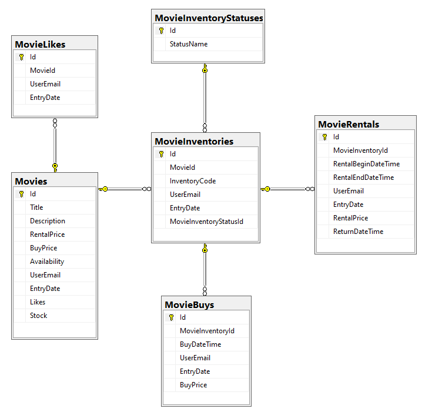
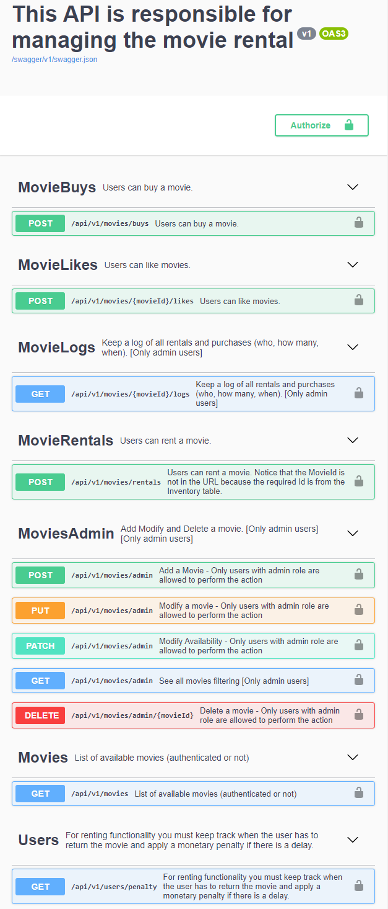
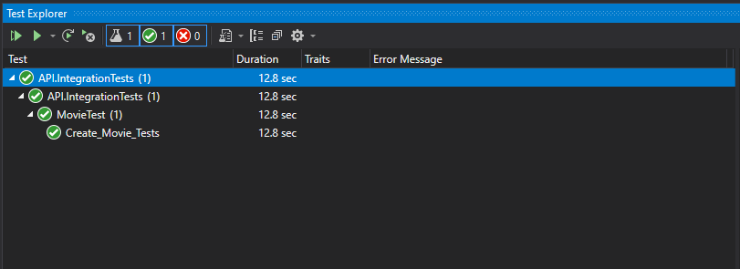

# TechnicalTest

I was asked to design and build a good RESTful API to manage a small movie rental.

# Tecnical Summary

- The project consists of two microservices each of them is designed with a clean architecture. 
- One microservice is in charge of Login management, and the other is the API responsible for managing the movie rental. 
- The DB is in the cloud. 
- This project use Swagger for documenting backend API. 
- Each microservice has its own DockerFile. 
- There is a tests folder where the unit tests are. 

## ER Diagram

This is the ER diagram that I use for this project. Keep in mind that the Stock is managed through an inventory table. There are also tables to get control of movie rentals and buys.

## Instalation

### Clone this project, run:
    - git clone https://gitlab.com/applaudostudios/dotnet-challenges/roberto-arguello.git

### Move to the folder project, run:
    - cd roberto-arguello

### Start docker containers, run:
    - docker-compose up

## Documentation

You can see swagger documentation in the following links:
- http://localhost:7001/swagger/index.html
- http://localhost:7001/swagger/index.html

## Project Requirements

### Movies
1. Add a Movie - Only users with admin role are allowed to perform the action
    - Tests: https://gitlab.com/applaudostudios/dotnet-challenges/roberto-arguello/-/blob/main/postman/01AddMovie.json
    - Please note
        - In step one, it is expected that the result is Not authorized to verify that it has security.
        - In some cases it is necessary to copy the token from a previous step

2. Modify a Movie - Only users with admin role are allowed to perform the action
    - Tests: https://gitlab.com/applaudostudios/dotnet-challenges/roberto-arguello/-/blob/main/postman/02ModifyMovie.json

3. Modify Availability - Only users with admin role are allowed to perform the action
    - Tests: https://gitlab.com/applaudostudios/dotnet-challenges/roberto-arguello/-/blob/main/postman/03ModifyAvailability.json
    
4. Delete a Movie - Only users with admin role are allowed to perform the action
    - Tests: https://gitlab.com/applaudostudios/dotnet-challenges/roberto-arguello/-/blob/main/postman/04DeleteMovie.json
        
5. See all movies filtering [Only admin users]
    - Tests: https://gitlab.com/applaudostudios/dotnet-challenges/roberto-arguello/-/blob/main/postman/05ListMoviesAdmin.json
    - Please note: 
        - As an admin I’m able to see all movies and filtering by availability/unavailability.
        - Search through the movies by name [and description].
        - [You can sort by any existing column, use '-' as a descent indicator. You can also add multiple columns separated by commas. Example: -likes,-stock,title]
        - The list must have pagination functionality.

6. List of available movies (authenticated or not).
    - Tests: https://gitlab.com/applaudostudios/dotnet-challenges/roberto-arguello/-/blob/main/postman/06ListMoviesPublic.json

### Movie Likes
7. Users can like movies.
    - Tests: https://gitlab.com/applaudostudios/dotnet-challenges/roberto-arguello/-/blob/main/postman/07MovieLikes.json

### Movie Rentals
8. Users can rent a movie.
    - Tests: https://gitlab.com/applaudostudios/dotnet-challenges/roberto-arguello/-/blob/main/postman/08MovieRentals.json
    - Please note that the MovieId is not in the URL because the required Id is from the Inventory table.

### Movie Buys
9. Users can buy a movie.
    - Tests: https://gitlab.com/applaudostudios/dotnet-challenges/roberto-arguello/-/blob/main/postman/09MovieBuys.json
    - Please note that the MovieId is not in the URL because the required Id is from the Inventory table.

### Movie Logs
10. Keep a log of all rentals and purchases (who, how many, when). [Only admin users]
    - Tests: https://gitlab.com/applaudostudios/dotnet-challenges/roberto-arguello/-/blob/main/postman/10MovieLog.json   
    - Please note the url format

### Users with Monetary penalty
11. For renting functionality you must keep track when the user has to return the movie and apply a monetary penalty if there is a delay.
    - Tests: https://gitlab.com/applaudostudios/dotnet-challenges/roberto-arguello/-/blob/main/postman/11UsersPenalty.json
    - Please note the url format

## Swagger Documentation

## Unit tests

